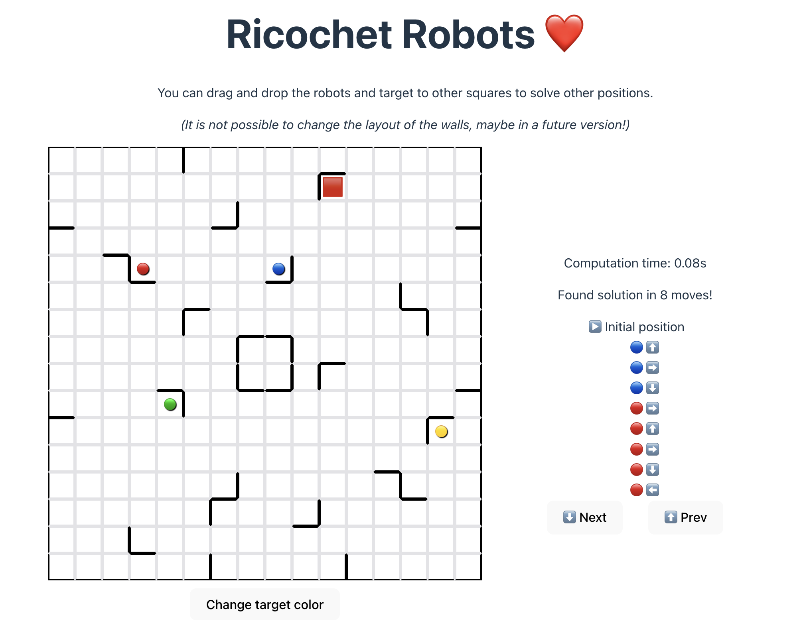

# Ricochets Robots



This project is a small solver for the [Ricochet Robots game](https://en.wikipedia.org/wiki/Ricochet_Robots).

You can play with it [here](https://ricochet-robots-ecru.vercel.app/).

You can move the robots and target around (and change the color of the target), and, after waiting a couple of seconds, the UI should show you the shortest solution (or one of them if there are multiple ones).

It is not possible to change the positions of the walls (it might add this in a future version!).

It's implemented in both TypeScript and Rust:
- the web app itself is implemented with TypeScript + React (code in the `webapp/` folder)
- the logic of the solver is implemented in Rust (code in the `solver_library/` folder), and compiled to WebAssembly so that it runs directly in the browser

This was mostly a fun weekend project for me to do some frontend and experiment with running Rust in the browser :\)

(I didn't really take the time to clean up the code, so don't look at it too closely)

##  Development

### Local development

- using the right node version: `nvm use`
- installing Javascript dependencies: `yarn`
- running the web app locally: `cd webapp/ && yarn run dev`
- re-compiling the Rust library to WASM: `wasm-pack build` (if the web app is running, it should detect the change and auto-reload) (more info in `solver_libary/README.md`)

### Deploying to Vercel

```sh
cd solver_library/
wasm-pack build --release
cd ..
yarn dlx vercel build --prod
yarn dlx vercel deploy --prebuilt --prod
```

### Random notes

#### On using Yarn + `node_modules/`

- This repository uses Yarn so that it can use a [Yarn workspace](https://yarnpkg.com/features/workspaces) to allow the webapp to import the WASM library (which is a separate module whose compiled version is located in the `solver_library/pkg` folder).
- This repository also [uses `node_modules` instead of Yarn Plug and Play](https://yarnpkg.com/configuration/yarnrc#nodeLinker), so that we get Typescript static analysis to work in VS code without additional configuration.
